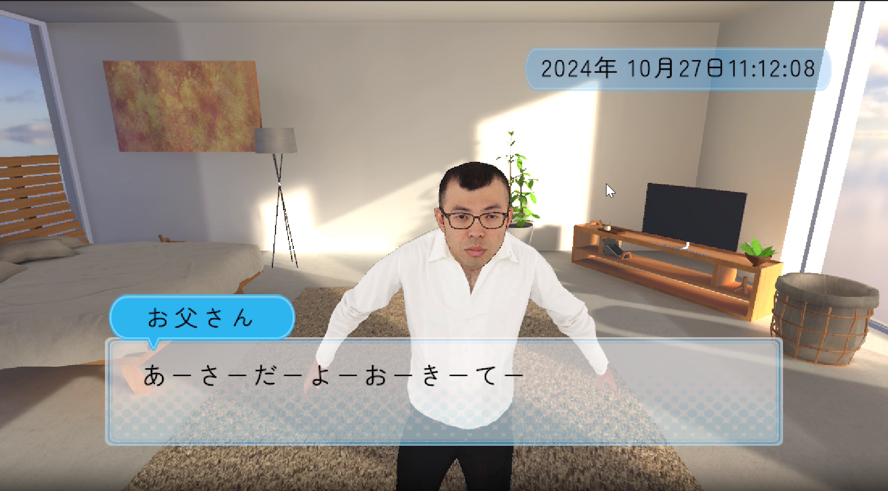
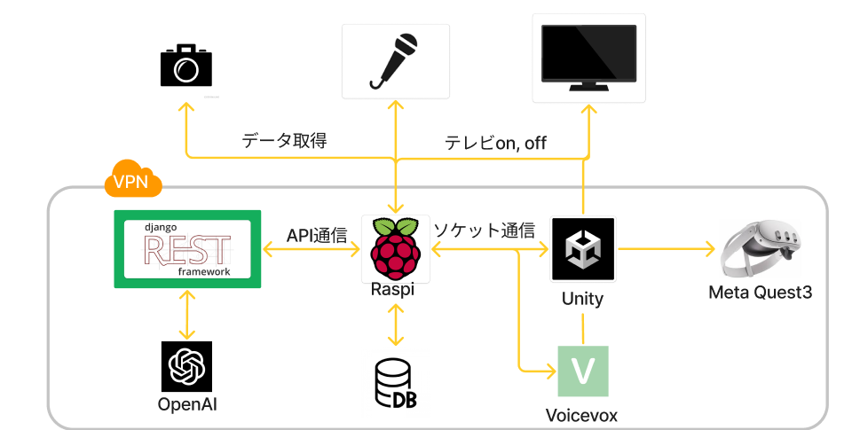

# Wake Mate

## イメージ図

## 構成図

## 製品概要

### 背景(製品開発のきっかけ、課題等）

- 私たちは meaningful morning チームはほとんどが 1 人暮らしの学生で構成されています。
- 実家にいる時はなぜか起きることができたのに、一人暮らしだとなかなか起きることができません。
  - （課題）それはお母さん（起こしてくれる人）がいないからです！

### 製品説明（具体的な製品の説明）

### 特長

#### 1. 特長 1 　テレビや VR 機器との連動したアバターがによる親しみやすい存在！

#### 2. 特長 2 　対話形式で、スケージュールや目覚まし時間のセット

#### 3. 特長 3 　カメラによる起床確認

#### 4. 特徴 4 　 LLM による画像・音声認識

### 解決出来ること

- 規則正しく生活できる
- 一人暮らしの寂しさを和らげられる

### 今後の展望

- 寝坊以外の対処
  - 身だしなみチェック（以下のことを外出時に教えてくれる）
    - 鼻毛で出るよ
    - ネクタイ曲がってるよ
    - シャツの襟がおかしいよ
    - 今日は雨が降るから傘を持って行きなさい
  - 忘れ物防止（外出前にリマインドしてくれる）
  - 時間管理
  - 料理
  - 寝落ち防止
- マルチデバイス対応
  - Quest3やVision ProなどのXRデバイスへの対応
    - AR・MRにより一人暮らしをさらにサポート
- 組み込みプログラムにより赤外線の家電操作を行い、起床時に電気やエアコンをつけれるようにする

### 注力したこと（こだわり等）

- LLM により毎回異なった応答をしてくれる
- LLM の出力に応じたアニメーションが再生
- LLM による画像認識で、👀 を持つ AI として機能
- LLM によって自然な会話を読み取れる
- テレビのON OFFも自動で行う
- DjangoによりAPIとして機能を実装
- SocketとVPNを組み合わせることで、どこからでもアクセスできる使いやすさ

## 開発技術

### 活用した技術

#### API・データ

- OpenAI API
- Google search API
- アバターモデル・音声

#### フレームワーク・ライブラリ・モジュール

- django
- restframework
- socket
- unity
- voicevox
- CECによるTV操作

#### デバイス

- PC
- raspberry pi
- TV
- マイク
- カメラ
- Meta Quest3

### 独自技術

#### ハッカソンで開発した独自機能・技術
- 自動でテレビの電源をオンオフ
- 自動で録音終了する rec.py
- scoket通信により、サーバーにテキストを送ることをトリガーとし自動でアバターに話させる機能
- LLM に特定の型で回答させるためのプロンプト技術
